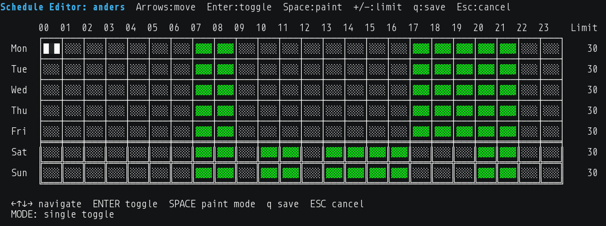

# playtimed

Screen time daemon with personality. Monitors gaming, enforces limits, communicates with humor.

Built for a dad who needs to help his son develop better computer habits - with transparency, humor, and an optional Clippy frontend.

## Quick Start

```bash
# Install (creates isolated venv at /opt/playtimed)
sudo ./scripts/install.sh

# Add a user to monitor
sudo playtimed user add anders --gaming-limit 120 --daily-total 180

# Start the daemon
sudo systemctl enable --now playtimed

# Check status (user can run this)
playtimed status
```

## Schedule Editor

Interactive curses TUI for per-hour, per-day schedule control with paint mode and per-day gaming limits.



## Features

- **Process monitoring** with CPU-based activity detection (idle launchers don't count)
- **Per-hour schedule grid** - 7x24 allowed/blocked hours with interactive curses editor
- **Per-day gaming limits** - different minute budgets for each day of the week
- **Browser domain tracking** - monitors Chrome and Firefox via window titles and session files
- **SQLite storage** for patterns, limits, and metrics
- **KDE notifications** with personality messages
- **Termination audit** - tracks every enforcement action
- **Automatic retention** - events purge after 30 days, summaries kept forever
- **CLI** for status, schedules, pattern management, user limits

## How It Works

1. Daemon polls for gaming processes (Minecraft, Steam games, Proton)
2. Only counts time when CPU usage exceeds threshold (actually playing, not idle)
3. Sends friendly warnings at 30/10/5/1 minutes remaining
4. Terminates games when time expires
5. Blocks relaunch attempts

## CLI Reference

```bash
playtimed status [user]                          # Check remaining time
playtimed schedule [user]                        # View schedule grid
playtimed schedule set <user> <spec>             # Batch edit schedule
playtimed schedule edit <user>                   # Interactive curses editor
playtimed schedule export [user]                 # JSON export
playtimed schedule import <file>                 # JSON import
playtimed audit [user]                           # Termination history
playtimed user add <name> --gaming-limit N       # Add monitored user
playtimed user edit <name>                       # Edit user limits
playtimed patterns list                          # Show detection patterns
playtimed patterns add <regex> <name> <category> # Add pattern
playtimed discover list                          # Show discovered processes
playtimed maintenance                            # Cleanup old data
```

## Files

```
/opt/playtimed/          # Installation with isolated venv
/etc/playtimed/          # Config
/var/lib/playtimed/      # SQLite database
```

## License

MIT
