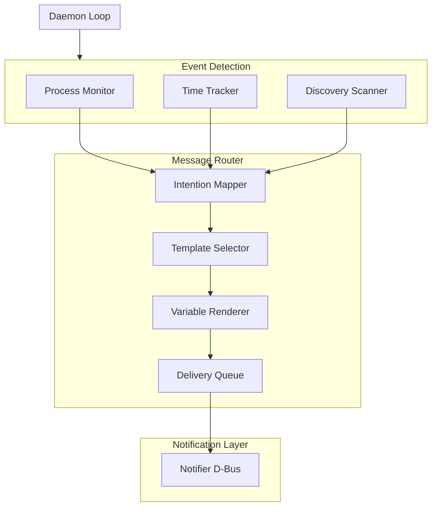
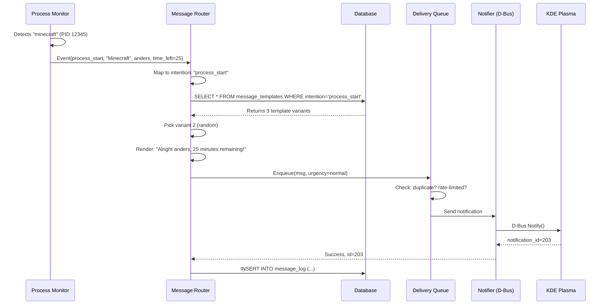
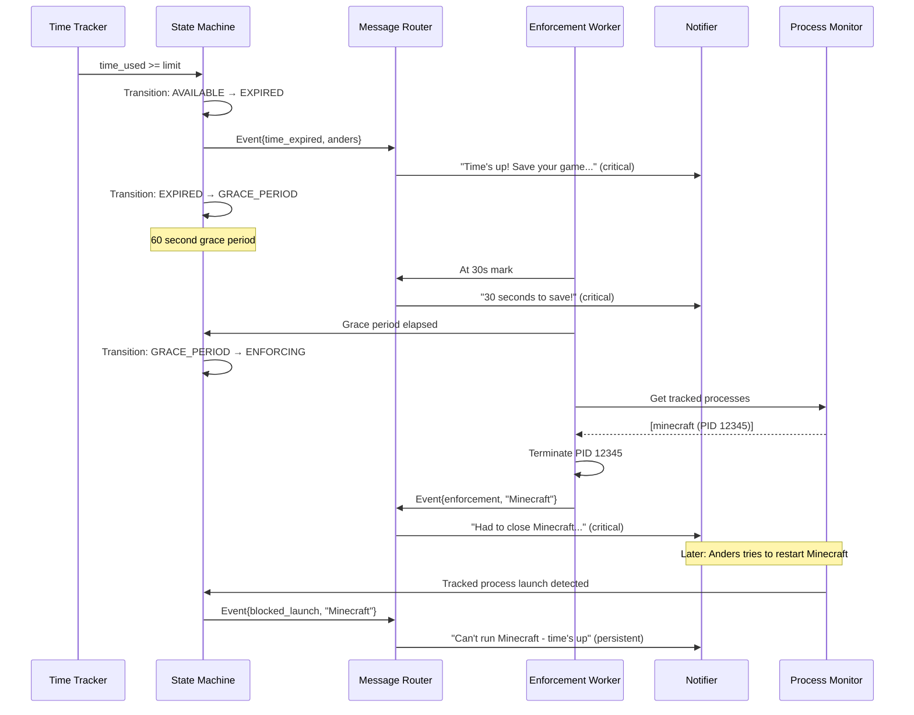
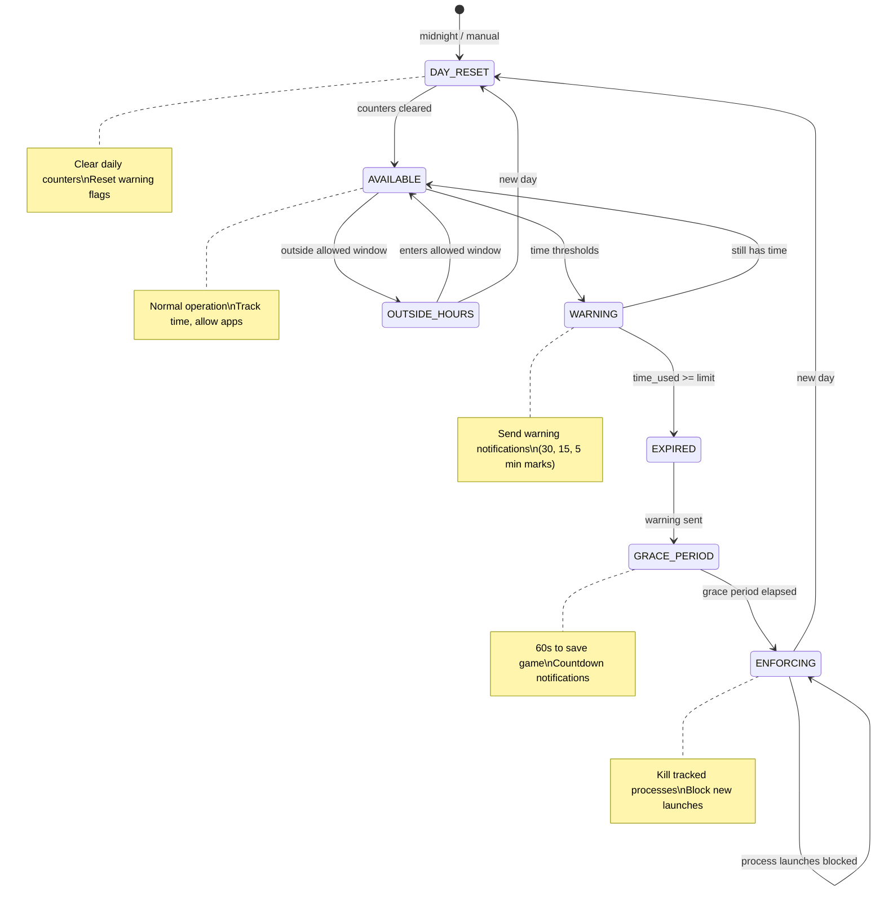

# Message Router Design

## Problem Statement

The daemon needs to communicate with users (Anders) in a consistent, friendly way. Currently, messages are hardcoded strings scattered throughout the codebase. This makes it hard to:

1. Maintain a consistent "Claude" personality
2. Vary messages to avoid repetition
3. Let parents customize messaging tone
4. Track what notifications have been sent
5. Handle different notification behaviors (one-shot vs persistent)

## Goals

1. **Centralize all user-facing messages** - One place to manage personality
2. **Enable variety** - Multiple phrasings for the same intent
3. **Support customization** - Parents can add/edit messages in DB
4. **Track delivery** - Know what was sent and when
5. **Handle different behaviors** - Informational vs enforcement messages
6. **Maintain testability** - Easy to verify messaging without full daemon

## Architecture Overview



## Component Purposes

### Event Detection Layer

**What it does:** Monitors system state and recognizes when something noteworthy happens.

**Components:**
- **Process Monitor** - Watches for tracked processes starting/stopping
- **Time Tracker** - Tracks accumulated time, fires when thresholds crossed
- **Discovery Scanner** - Identifies new high-CPU processes

**Output:** Events with context (e.g., "process_started" with process name, user, time remaining)

### Message Router

**What it does:** Translates raw events into user-friendly notifications.

**Responsibilities:**
1. **Intention Mapping** - Determines what kind of message this event needs
2. **Template Selection** - Picks a message variant (random or sequential)
3. **Variable Rendering** - Fills in `{user}`, `{process}`, etc.
4. **Delivery Management** - Handles rate limiting, deduplication
5. **Logging** - Records what was sent for debugging/analytics

**Why separate from detection?** The same event might need different messaging based on context. A process starting when time is almost up should mention the time constraint.

### Delivery Queue

**What it does:** Manages the flow of notifications to prevent spam.

**Responsibilities:**
1. **Rate Limiting** - Don't flood the user with notifications
2. **Deduplication** - Same message within N seconds = skip
3. **Priority Sorting** - Critical messages jump the queue
4. **Replacement Logic** - Enforcement messages update existing notification

### Notifier (D-Bus)

**What it does:** Actually displays the notification on screen.

**Already implemented** in `notify.py`. Supports KDE Plasma and freedesktop-compliant servers.

## Data Flow Examples

### Scenario 1: Anders starts Minecraft with 25 minutes remaining



### Scenario 2: Time limit reached, enforcement flow



## Message Intentions

Each notification has an **intention** - the semantic meaning of what we're communicating. Multiple template variants can exist for each intention.

### Core Intentions

| Intention | Trigger | Example |
|-----------|---------|---------|
| `process_start` | Tracked process begins | "I see you started Minecraft!" |
| `process_end` | Tracked process exits | "Done with Factorio? Hope you had fun!" |
| `time_warning_30` | 30 min remaining | "Half hour left for today" |
| `time_warning_15` | 15 min remaining | "15 minutes - maybe find a save point?" |
| `time_warning_5` | 5 min remaining | "5 minutes! Wrap it up!" |
| `time_expired` | Time limit reached | "Time's up for today!" |
| `discovery` | New high-CPU process found | "Noticed you're running NewGame" |
| `enforcement` | App terminated | "Had to close Minecraft - time's up" |
| `day_reset` | New day begins | "Good morning! Fresh day, fresh limits" |
| `mode_change` | Daemon mode changed | "Switching to strict mode" |

### Enforcement Intentions (Persistent)

| Intention | Trigger | Behavior |
|-----------|---------|----------|
| `blocked_launch` | Attempted to start blocked app | Persistent until dismissed |
| `over_time` | Using time after limit | Repeats every N minutes |
| `outside_hours` | Using outside allowed hours | Persistent |

## Database Schema

### message_templates

```sql
CREATE TABLE message_templates (
    id INTEGER PRIMARY KEY,
    intention TEXT NOT NULL,        -- 'process_start', 'time_warning_15', etc.
    variant INTEGER NOT NULL DEFAULT 0,  -- 0, 1, 2... for variety
    title TEXT NOT NULL,            -- Notification title (supports vars)
    body TEXT NOT NULL,             -- Notification body (supports vars)
    icon TEXT DEFAULT 'dialog-information',
    urgency TEXT DEFAULT 'normal',  -- 'low', 'normal', 'critical'
    enabled INTEGER DEFAULT 1,
    UNIQUE(intention, variant)
);
```

### message_log

```sql
CREATE TABLE message_log (
    id INTEGER PRIMARY KEY,
    timestamp TEXT NOT NULL,
    user TEXT NOT NULL,
    intention TEXT NOT NULL,
    template_id INTEGER,
    rendered_title TEXT,
    rendered_body TEXT,
    notification_id INTEGER,        -- D-Bus notification ID
    FOREIGN KEY (template_id) REFERENCES message_templates(id)
);
```

## Variable Substitution

Templates support these variables:

| Variable | Description | Example |
|----------|-------------|---------|
| `{user}` | Username | "anders" |
| `{process}` | Process display name | "Minecraft" |
| `{pattern}` | Pattern name (may differ) | "minecraft-java" |
| `{time_left}` | Minutes remaining | "15" |
| `{time_used}` | Minutes used today | "105" |
| `{time_limit}` | Daily limit in minutes | "120" |
| `{category}` | Process category | "gaming" |
| `{day}` | Day of week | "Monday" |

### Example Templates

The tone should be encouraging and collaborative, not surveillance-like. Claude is a helpful presence, not a watchdog.

```
intention: process_start, variant: 0
title: "Have fun!"
body: "Starting up {process}! You've got {time_left} minutes of gaming time - enjoy!"

intention: process_start, variant: 1
title: "{process}"
body: "Nice choice, {user}. {time_left} minutes available today - make it count!"

intention: process_start, variant: 2
title: "Game time"
body: "Launching {process}. You've got {time_left} minutes - I'll give you a heads up when it's getting low."
```

**Tone guidelines:**
- Encouraging, not nagging
- Informative, not threatening
- Collaborative ("I'll help you keep track") not adversarial ("I'm watching you")
- Brief and friendly - Anders should feel supported, not surveilled

## State Machine: Daily Lifecycle

Each monitored user has a state that determines what actions the daemon takes.



### State Descriptions

| State | Purpose | Daemon Behavior |
|-------|---------|-----------------|
| `DAY_RESET` | Transition state at day boundary | Clears daily_summary, resets warning flags |
| `AVAILABLE` | Normal operation | Tracks time, monitors processes, allows apps |
| `WARNING` | User approaching limit | Same as AVAILABLE but sends warning messages |
| `EXPIRED` | Time limit reached | Initiates grace period |
| `GRACE_PERIOD` | Brief window to save/exit | Countdown notifications, no enforcement yet |
| `ENFORCING` | Actively blocking | Terminates tracked processes, blocks launches |
| `OUTSIDE_HOURS` | Outside allowed time window | Same enforcement as ENFORCING |

## Workers

### 1. MessageRouter

Core router that:
- Receives events from daemon
- Selects appropriate intention
- Picks template variant (random or round-robin)
- Renders variables
- Sends to notification system
- Logs to message_log

### 2. ScheduleWorker

Manages time-based events:
- Tracks warning thresholds per user
- Fires at 30/15/5 minute marks
- Handles day reset at midnight (configurable)
- Manages allowed hours transitions

### 3. EnforcementWorker

Handles persistent messaging:
- Sends repeated reminders when over time
- Manages notification replacement (updates instead of stacking)
- Handles grace period countdown

## Configuration

### daemon_config additions

| Key | Default | Description |
|-----|---------|-------------|
| `message_variety` | `random` | How to pick variants: `random`, `sequential` |
| `enforcement_interval` | `300` | Seconds between enforcement reminders |
| `grace_period_seconds` | `60` | Time after limit before enforcement |
| `reset_hour` | `4` | Hour of day for reset (4am default) |
| `warning_thresholds` | `30,15,5` | Minutes remaining for warnings |

## Gaps and Edge Cases

### Where is user state stored?

The user's current state (AVAILABLE, ENFORCING, etc.) needs to persist across daemon restarts. Options:

1. **In-memory only** - Lost on restart, re-computed from daily_summary
2. **In database** - New `user_state` table or column in `user_limits`
3. **State file** - `/var/lib/playtimed/state.json`

**Recommendation:** Store in `daily_summary` table as new column `state TEXT`. On startup, compute state from time_used vs limits.

### Warning deduplication

We need to track which warnings have been sent today (so we don't spam "30 minutes left" every poll cycle).

```sql
-- Add to daily_summary
warnings_sent_30 INTEGER DEFAULT 0,
warnings_sent_15 INTEGER DEFAULT 0,
warnings_sent_5 INTEGER DEFAULT 0,
```

### Multiple tracked processes

What if Anders is running both Minecraft AND Factorio?

- **Time tracking:** Already handled - total gaming time accumulates
- **Process start message:** Send for each? Or just first?
- **Enforcement:** Kill all tracked processes, not just one

**Recommendation:** Send process_start only for first tracked process of the session. Track `active_processes` list in user state.

### Process end detection

How do we know a game exited vs crashed vs was killed by us?

Current session tracking has `end_reason`: 'natural', 'enforced', 'logout', 'unknown'

- **Natural:** Process exit code 0, not in enforcing state
- **Enforced:** We killed it
- **Unknown:** Process disappeared without us noticing

### Passthrough mode interaction

In passthrough mode, daemon monitors but doesn't enforce. State machine should:
- Still track state transitions (for parent visibility)
- Still send informational messages
- Skip enforcement actions (no kills, no blocked_launch)

### Outside hours vs time limit

These can conflict:
- Anders has 30 min left, but it's 9:01 PM (end time is 9:00)
- Should get OUTSIDE_HOURS, not WARNING

**Priority:** OUTSIDE_HOURS > EXPIRED > WARNING > AVAILABLE

### Day reset timing

When does the "day" reset?

- **Midnight:** Simple but might interrupt late-night sessions
- **4 AM:** Common for analytics systems
- **Configurable:** Let parent decide

**Recommendation:** Default to 4 AM, configurable via `reset_hour`.

### Daemon restart recovery

On startup, daemon should:
1. Load user limits
2. Check current time vs allowed hours
3. Calculate time_used from daily_summary
4. Derive state from above
5. Resume enforcement if needed

## Implementation Plan

### Phase 1: Database & Templates
- [ ] Add `message_templates` table
- [ ] Add `message_log` table
- [ ] Seed default templates
- [ ] Create MessageTemplate model

### Phase 2: Message Router
- [ ] Create `router.py` module
- [ ] Implement variable substitution
- [ ] Implement template selection
- [ ] Connect to notify.py

### Phase 3: Workers
- [ ] Integrate router into daemon loop
- [ ] Add ScheduleWorker for time events
- [ ] Add EnforcementWorker for persistent messages

### Phase 4: State Machine
- [ ] Implement user state tracking
- [ ] Add state transitions
- [ ] Handle edge cases (mode changes, config reload)

### Phase 5: CLI & Testing
- [ ] Add `playtimed message test <intention>` command
- [ ] Add `playtimed message list` to show templates
- [ ] Add `playtimed message add/edit` for customization
- [ ] Write tests for router logic
