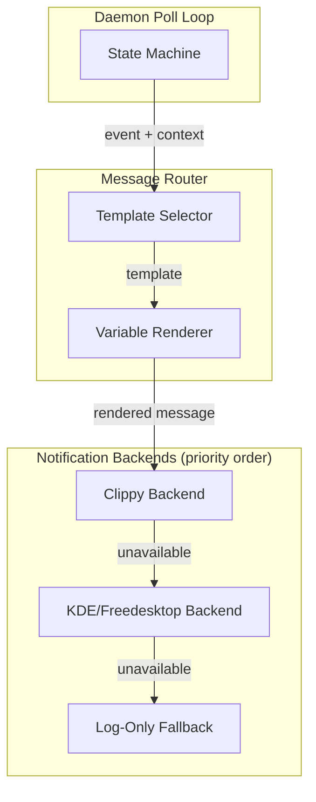
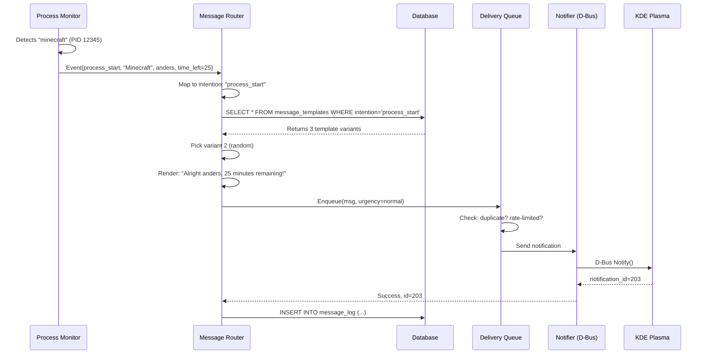
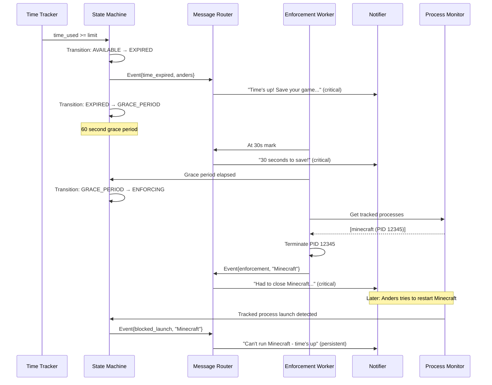
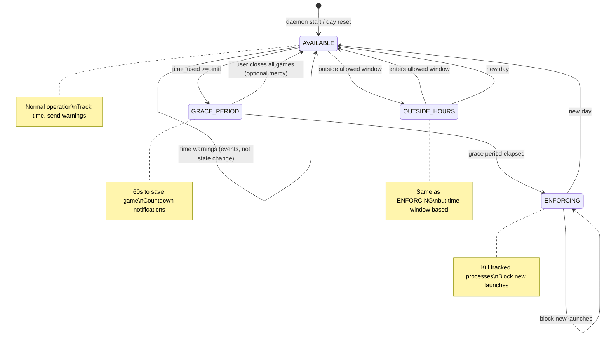

# Message Router Design

## Problem Statement

The daemon needs to communicate with users (Anders) in a consistent, friendly way. Currently, messages are hardcoded strings scattered throughout the codebase. This makes it hard to:

1. Maintain a consistent "Claude" personality
2. Vary messages to avoid repetition
3. Let parents customize messaging tone
4. Track what notifications have been sent
5. Handle different notification behaviors (one-shot vs persistent)

## Goals

1. **Centralize all user-facing messages** - One place to manage personality
2. **Enable variety** - Multiple phrasings for the same intent
3. **Support customization** - Parents can add/edit messages in DB
4. **Track delivery** - Know what was sent and when
5. **Handle different behaviors** - Informational vs enforcement messages
6. **Maintain testability** - Easy to verify messaging without full daemon

## User Model

**Single user per session.** The computer may have multiple monitored users (e.g., siblings), but only one is logged in at a time. The daemon tracks all configured users but only actively monitors whoever is currently logged in.

This simplifies:
- No need for multi-user notification routing
- No concurrent time tracking conflicts
- State is per-user in database, current user determined at runtime

## Architecture Overview



## Component Purposes

### State Machine (in Daemon Loop)

**What it does:** Manages user state transitions and emits events.

Lives in the existing poll loop (`_process_user`). On each cycle:
1. Load user state from DB
2. Observe current processes
3. Compute what state SHOULD be
4. If changed, emit event to router
5. Write new state to DB

**Events emitted:** `process_start`, `process_end`, `time_warning`, `time_expired`, `enforcement`, `discovery`, etc.

### Message Router

**What it does:** Translates events into rendered notifications.

**Simplified design** (no separate queue or intention mapper):
1. **Template Selection** - Query DB for templates matching event type, pick variant
2. **Variable Rendering** - Fill in `{user}`, `{process}`, `{time_left}`, etc.
3. **Delivery** - Pass to notification backend chain
4. **Logging** - Record what was sent

Events map directly to intentions (1:1), so no separate mapper needed.
Deduplication handled by state machine (warnings only fire once via flags).

### Notification Backend Abstraction

**What it does:** Delivers notifications with graceful fallback.

```python
class NotificationBackend(Protocol):
    """Interface for notification delivery."""

    def is_available(self) -> bool:
        """Check if this backend can deliver notifications."""
        ...

    def send(self, title: str, body: str, urgency: str,
             icon: str, replaces_id: int = 0) -> int:
        """Send notification. Returns notification ID or 0 on failure."""
        ...

    def close(self, notification_id: int) -> bool:
        """Close/dismiss a notification."""
        ...
```

**Priority chain:**

| Priority | Backend | D-Bus Service | Description |
|----------|---------|---------------|-------------|
| 1 | Clippy | `org.playtimed.Clippy` | Future: animated Clippy widget |
| 2 | KDE/Freedesktop | `org.freedesktop.Notifications` | Standard desktop notifications |
| 3 | Log-only | N/A | Just log, no visual notification |

**Fallback logic:**
```python
class NotificationDispatcher:
    def __init__(self):
        self.backends = [
            ClippyBackend(),      # Check first
            FreedesktopBackend(), # Fallback
            LogOnlyBackend(),     # Last resort
        ]

    def send(self, title: str, body: str, **kwargs) -> int:
        for backend in self.backends:
            if backend.is_available():
                result = backend.send(title, body, **kwargs)
                if result:
                    return result
        return 0  # All backends failed
```

This allows:
- Future Clippy widget to take over seamlessly
- Graceful degradation if no notification daemon
- Easy testing (inject mock backend)

### Error Handling

**Template rendering failures:**
```python
def render(template: str, context: dict) -> str:
    try:
        return template.format(**context)
    except KeyError as e:
        log.warning(f"Missing template variable: {e}")
        # Return template with unfilled vars rather than crash
        return template
```

**Delivery failures:**
- Backend chain handles unavailable backends automatically
- If all backends fail, log the message (LogOnlyBackend always succeeds)
- Message log records `backend='failed'` if no backend could deliver

**Database failures:**
- Template query fails → use hardcoded fallback message
- Log write fails → continue (logging is nice-to-have, not critical)

## Data Flow Examples

### Scenario 1: Anders starts Minecraft with 25 minutes remaining



### Scenario 2: Time limit reached, enforcement flow



## Message Intentions

Each notification has an **intention** - the semantic meaning of what we're communicating. Multiple template variants can exist for each intention.

### Core Intentions

| Intention | Trigger | Example |
|-----------|---------|---------|
| `process_start` | Tracked process begins | "I see you started Minecraft!" |
| `process_end` | Tracked process exits | "Done with Factorio? Hope you had fun!" |
| `time_warning_30` | 30 min remaining | "Half hour left for today" |
| `time_warning_15` | 15 min remaining | "15 minutes - maybe find a save point?" |
| `time_warning_5` | 5 min remaining | "5 minutes! Wrap it up!" |
| `time_expired` | Time limit reached | "Time's up for today!" |
| `discovery` | New high-CPU process found | "Noticed you're running NewGame" |
| `enforcement` | App terminated | "Had to close Minecraft - time's up" |
| `day_reset` | New day begins | "Good morning! Fresh day, fresh limits" |
| `mode_change` | Daemon mode changed | "Switching to strict mode" |

### Enforcement Intentions (Persistent)

| Intention | Trigger | Behavior |
|-----------|---------|----------|
| `blocked_launch` | Attempted to start blocked app | Persistent until dismissed |
| `over_time` | Using time after limit | Repeats every N minutes |
| `outside_hours` | Using outside allowed hours | Persistent |

## Database Schema

### New Tables

#### message_templates

```sql
CREATE TABLE message_templates (
    id INTEGER PRIMARY KEY,
    intention TEXT NOT NULL,        -- 'process_start', 'time_warning', etc.
    variant INTEGER NOT NULL DEFAULT 0,  -- 0, 1, 2... for variety
    title TEXT NOT NULL,            -- Notification title (supports vars)
    body TEXT NOT NULL,             -- Notification body (supports vars)
    icon TEXT DEFAULT 'dialog-information',
    urgency TEXT DEFAULT 'normal',  -- 'low', 'normal', 'critical'
    enabled INTEGER DEFAULT 1,
    created_at TEXT NOT NULL,
    UNIQUE(intention, variant)
);

CREATE INDEX idx_templates_intention ON message_templates(intention, enabled);
```

#### message_log

```sql
CREATE TABLE message_log (
    id INTEGER PRIMARY KEY,
    timestamp TEXT NOT NULL,
    user TEXT NOT NULL,
    intention TEXT NOT NULL,
    template_id INTEGER,
    rendered_title TEXT,
    rendered_body TEXT,
    notification_id INTEGER,        -- D-Bus notification ID
    backend TEXT,                   -- 'clippy', 'freedesktop', 'log'
    FOREIGN KEY (template_id) REFERENCES message_templates(id)
);

CREATE INDEX idx_message_log_user_time ON message_log(user, timestamp);
```

### Schema Migration: daily_summary additions

```sql
-- Add state tracking columns to existing daily_summary table
ALTER TABLE daily_summary ADD COLUMN state TEXT DEFAULT 'available';
ALTER TABLE daily_summary ADD COLUMN gaming_active INTEGER DEFAULT 0;
ALTER TABLE daily_summary ADD COLUMN gaming_started_at TEXT;
ALTER TABLE daily_summary ADD COLUMN last_poll_at TEXT;
ALTER TABLE daily_summary ADD COLUMN warned_30 INTEGER DEFAULT 0;
ALTER TABLE daily_summary ADD COLUMN warned_15 INTEGER DEFAULT 0;
ALTER TABLE daily_summary ADD COLUMN warned_5 INTEGER DEFAULT 0;
```

### Migration Function

```python
def migrate_message_router(db_path: str):
    """Add message router tables and columns."""
    with get_connection(db_path) as conn:
        # Check if migration needed
        cursor = conn.execute("PRAGMA table_info(daily_summary)")
        columns = {row[1] for row in cursor.fetchall()}

        if 'state' not in columns:
            # Add state tracking to daily_summary
            conn.executescript("""
                ALTER TABLE daily_summary ADD COLUMN state TEXT DEFAULT 'available';
                ALTER TABLE daily_summary ADD COLUMN gaming_active INTEGER DEFAULT 0;
                ALTER TABLE daily_summary ADD COLUMN gaming_started_at TEXT;
                ALTER TABLE daily_summary ADD COLUMN last_poll_at TEXT;
                ALTER TABLE daily_summary ADD COLUMN warned_30 INTEGER DEFAULT 0;
                ALTER TABLE daily_summary ADD COLUMN warned_15 INTEGER DEFAULT 0;
                ALTER TABLE daily_summary ADD COLUMN warned_5 INTEGER DEFAULT 0;
            """)

        # Create message tables if not exist
        conn.executescript("""
            CREATE TABLE IF NOT EXISTS message_templates (
                id INTEGER PRIMARY KEY,
                intention TEXT NOT NULL,
                variant INTEGER NOT NULL DEFAULT 0,
                title TEXT NOT NULL,
                body TEXT NOT NULL,
                icon TEXT DEFAULT 'dialog-information',
                urgency TEXT DEFAULT 'normal',
                enabled INTEGER DEFAULT 1,
                created_at TEXT NOT NULL,
                UNIQUE(intention, variant)
            );

            CREATE TABLE IF NOT EXISTS message_log (
                id INTEGER PRIMARY KEY,
                timestamp TEXT NOT NULL,
                user TEXT NOT NULL,
                intention TEXT NOT NULL,
                template_id INTEGER,
                rendered_title TEXT,
                rendered_body TEXT,
                notification_id INTEGER,
                backend TEXT,
                FOREIGN KEY (template_id) REFERENCES message_templates(id)
            );

            CREATE INDEX IF NOT EXISTS idx_templates_intention
                ON message_templates(intention, enabled);
            CREATE INDEX IF NOT EXISTS idx_message_log_user_time
                ON message_log(user, timestamp);
        """)

        # Seed default templates if empty
        count = conn.execute("SELECT COUNT(*) FROM message_templates").fetchone()[0]
        if count == 0:
            seed_default_templates(conn)
```

### Retention Policy

Add to maintenance routine:

```python
def cleanup_message_log(conn, days: int = 7):
    """Delete message_log entries older than N days."""
    cutoff = (datetime.now() - timedelta(days=days)).isoformat()
    conn.execute("DELETE FROM message_log WHERE timestamp < ?", (cutoff,))
```

## Variable Substitution

Templates support these variables:

| Variable | Description | Example |
|----------|-------------|---------|
| `{user}` | Username | "anders" |
| `{process}` | Process display name | "Minecraft" |
| `{pattern}` | Pattern name (may differ) | "minecraft-java" |
| `{time_left}` | Minutes remaining | "15" |
| `{time_used}` | Minutes used today | "105" |
| `{time_limit}` | Daily limit in minutes | "120" |
| `{category}` | Process category | "gaming" |
| `{day}` | Day of week | "Monday" |

### Example Templates

The tone should be encouraging and collaborative, not surveillance-like. Claude is a helpful presence, not a watchdog.

```
intention: process_start, variant: 0
title: "Have fun!"
body: "Starting up {process}! You've got {time_left} minutes of gaming time - enjoy!"

intention: process_start, variant: 1
title: "{process}"
body: "Nice choice, {user}. {time_left} minutes available today - make it count!"

intention: process_start, variant: 2
title: "Game time"
body: "Launching {process}. You've got {time_left} minutes - I'll give you a heads up when it's getting low."
```

**Tone guidelines:**
- Encouraging, not nagging
- Informative, not threatening
- Collaborative ("I'll help you keep track") not adversarial ("I'm watching you")
- Brief and friendly - Anders should feel supported, not surveilled

## State Machine: Daily Lifecycle

Each monitored user has a state that determines what actions the daemon takes.

**Note:** Warnings are events that fire during `AVAILABLE` state, not a separate state. This avoids the contradiction of being "in WARNING state" while also tracking which warnings have been sent.



### States

| State | Purpose | Daemon Behavior |
|-------|---------|-----------------|
| `AVAILABLE` | Normal operation | Tracks time, monitors processes, allows apps. Sends warning events at thresholds. |
| `GRACE_PERIOD` | Brief window to save/exit | Countdown notifications. No kills yet. User can avoid enforcement by closing games. |
| `ENFORCING` | Actively blocking | Terminates tracked processes, blocks new launches. |
| `OUTSIDE_HOURS` | Outside allowed time window | Same as ENFORCING but triggered by clock, not usage. |

### Warning Events (during AVAILABLE state)

Warnings are **events**, not states. Tracked via flags to avoid repeating:

```sql
-- In daily_summary
warned_30 INTEGER DEFAULT 0,  -- 1 if 30-min warning sent today
warned_15 INTEGER DEFAULT 0,
warned_5 INTEGER DEFAULT 0,
```

**Logic:**
```python
if state == AVAILABLE and gaming_active:
    minutes_left = (limit - time_used) / 60

    if minutes_left <= 30 and not warned_30:
        emit_event('time_warning', minutes=30)
        warned_30 = True

    if minutes_left <= 15 and not warned_15:
        emit_event('time_warning', minutes=15)
        warned_15 = True

    # etc.
```

Flags reset on day boundary along with time counters.

## Workers

### 1. MessageRouter

Core router that:
- Receives events from daemon
- Selects appropriate intention
- Picks template variant (random or round-robin)
- Renders variables
- Sends to notification system
- Logs to message_log

### 2. ScheduleWorker

Manages time-based events:
- Tracks warning thresholds per user
- Fires at 30/15/5 minute marks
- Handles day reset at midnight (configurable)
- Manages allowed hours transitions

### 3. EnforcementWorker

Handles persistent messaging:
- Sends repeated reminders when over time
- Manages notification replacement (updates instead of stacking)
- Handles grace period countdown

## Configuration

### daemon_config additions

| Key | Default | Description |
|-----|---------|-------------|
| `message_variety` | `random` | How to pick variants: `random`, `sequential` |
| `enforcement_interval` | `300` | Seconds between enforcement reminders |
| `grace_period_seconds` | `60` | Time after limit before enforcement |
| `reset_hour` | `4` | Hour of day for reset (4am default) |
| `warning_thresholds` | `30,15,5` | Minutes remaining for warnings |

## Core Design Principles

### Idempotent State Updates

All state updates are idempotent - the daemon can crash, restart, or run multiple checks without corrupting data. State is derived from database, not held in memory.

```
Each poll cycle:
1. Read current state from DB
2. Observe current system (processes, time)
3. Compute what state SHOULD be
4. If different, transition and emit events
5. Write new state to DB
```

This means:
- No "missed" transitions due to timing
- Daemon restart = seamless recovery
- State is always consistent with reality

### Wall-Clock Time Tracking (Not Cumulative)

**Time used = wall-clock time when ANY tracked process is active.**

```
Example: 2-hour limit

Timeline:
  14:00  Anders starts Minecraft
  14:30  Anders also starts Factorio (both running)
  15:00  Anders closes Minecraft (Factorio still running)
  15:30  Anders closes Factorio
  16:00  Anders starts Minecraft again
  16:30  Time limit reached

Time used:
  14:00-15:30 = 1.5 hours (doesn't matter that 2 games overlapped)
  16:00-16:30 = 0.5 hours
  Total: 2 hours ✓
```

### Timestamp-Based Tracking (Not Interval-Based)

**Problem with interval-based:**
```python
# BAD: assumes poll_interval is accurate
if gaming_active:
    gaming_time += poll_interval  # What if poll was delayed?
```

**Better: use actual timestamps:**
```python
# GOOD: compute from real clock
if gaming_active:
    now = time.time()
    elapsed = now - last_check_time
    gaming_time += elapsed
    last_check_time = now
```

**Schema:**
```sql
-- In daily_summary
gaming_active INTEGER DEFAULT 0,
gaming_started_at TEXT,  -- ISO timestamp when current session began
last_poll_at TEXT,       -- timestamp of last poll (for elapsed calc)
```

**Logic:**
```python
now = datetime.now()

if gaming_active and was_gaming_active:
    # Continuing session - add elapsed time since last poll
    elapsed = (now - last_poll_at).total_seconds()
    gaming_time += elapsed

elif gaming_active and not was_gaming_active:
    # Just started gaming
    gaming_started_at = now
    # Don't add time yet - will add on next poll

elif not gaming_active and was_gaming_active:
    # Just stopped gaming - add final elapsed
    elapsed = (now - last_poll_at).total_seconds()
    gaming_time += elapsed
    gaming_started_at = None

last_poll_at = now
```

This handles:
- Poll delays (CPU load, system sleep)
- Laptop suspend/resume
- Variable poll timing

### Suspend/Resume Handling

What if the laptop suspends for 2 hours while a game is "running"?

**Problem:** Game process still exists after resume, but user wasn't actually playing.

**Solution:** Cap elapsed time at reasonable maximum (e.g., 2x poll_interval)

```python
elapsed = (now - last_poll_at).total_seconds()
max_elapsed = poll_interval * 2  # 60 seconds if poll is 30s

if elapsed > max_elapsed:
    # Likely suspend/resume - don't charge full time
    log.info(f"Large gap detected ({elapsed}s), capping at {max_elapsed}s")
    elapsed = max_elapsed
```

This is generous to the user (doesn't charge for suspend time) while still being accurate during normal operation.

### Process-Independent Time

We track time per USER, not per process:

| What we track | How |
|---------------|-----|
| User's gaming time today | `daily_summary.gaming_time` |
| User's total screen time | `daily_summary.total_time` |
| Individual process sessions | `sessions` table (for analytics) |

The `sessions` table records each process start/stop for historical analysis, but enforcement is based on user-level totals.

## Gaps and Edge Cases

### Where is user state stored?

The user's current state (AVAILABLE, ENFORCING, etc.) persists in the database for idempotent operation.

**Schema addition to `daily_summary`:**

```sql
ALTER TABLE daily_summary ADD COLUMN state TEXT DEFAULT 'available';
ALTER TABLE daily_summary ADD COLUMN gaming_active INTEGER DEFAULT 0;
ALTER TABLE daily_summary ADD COLUMN last_state_change TEXT;
```

On each poll:
1. Load state from `daily_summary`
2. Check current processes
3. Update `gaming_active` (1 if any tracked gaming process running)
4. If `gaming_active`, add poll_interval to `gaming_time`
5. Compute correct state from time_used vs limits
6. If state changed, emit event and update DB

### Warning deduplication

We need to track which warnings have been sent today (so we don't spam "30 minutes left" every poll cycle).

```sql
-- Add to daily_summary
warnings_sent_30 INTEGER DEFAULT 0,
warnings_sent_15 INTEGER DEFAULT 0,
warnings_sent_5 INTEGER DEFAULT 0,
```

### Multiple tracked processes

What if Anders is running both Minecraft AND Factorio?

- **Time tracking:** Wall-clock based - both running = still one clock ticking
- **Process start message:** Send for each new process, but mention total time not per-process
- **Enforcement:** Kill ALL tracked processes when enforcing

**Implementation:**
```python
# Each poll cycle
active_gaming_pids = get_active_tracked_processes(user, category='gaming')

if active_gaming_pids and not user_state.gaming_active:
    # Transition: not gaming → gaming
    user_state.gaming_active = True
    emit_event('gaming_session_start', first_process)

elif not active_gaming_pids and user_state.gaming_active:
    # Transition: gaming → not gaming
    user_state.gaming_active = False
    emit_event('gaming_session_end')

if user_state.gaming_active:
    user_state.gaming_time += poll_interval
```

### Process end detection

How do we know a game exited vs crashed vs was killed by us?

Current session tracking has `end_reason`: 'natural', 'enforced', 'logout', 'unknown'

- **Natural:** Process exit code 0, not in enforcing state
- **Enforced:** We killed it
- **Unknown:** Process disappeared without us noticing

### Passthrough mode interaction

In passthrough mode, daemon monitors but doesn't enforce. State machine should:
- Still track state transitions (for parent visibility)
- Still send informational messages
- Skip enforcement actions (no kills, no blocked_launch)

### Outside hours vs time limit

These can conflict:
- Anders has 30 min left, but it's 9:01 PM (end time is 9:00)
- Should get OUTSIDE_HOURS, not WARNING

**Priority:** OUTSIDE_HOURS > EXPIRED > WARNING > AVAILABLE

### Day reset timing

When does the "day" reset?

- **Midnight:** Simple but might interrupt late-night sessions
- **4 AM:** Common for analytics systems
- **Configurable:** Let parent decide

**Recommendation:** Default to 4 AM, configurable via `reset_hour`.

### Poll Interval and CPU Efficiency

**Target:** Minimal CPU footprint. This daemon should be invisible.

**Poll interval:** 30 seconds (configurable)

This is a reasonable tradeoff:
- Accurate enough for time tracking (±30s on a 2-hour limit = 0.4% error)
- Fast enough to catch process launches before user notices delay
- Slow enough to be negligible CPU impact

**CPU optimization strategies:**

1. **Sleep between polls** - Use `time.sleep()`, not busy-wait
   ```python
   while running:
       poll()
       time.sleep(poll_interval)
   ```

2. **Filter processes early** - Don't iterate all processes if no users are monitored
   ```python
   if not monitored_users:
       continue
   ```

3. **Cache compiled regexes** - Pattern matching is the expensive part
   ```python
   # On startup / config reload
   self.compiled_patterns = {
       p['id']: re.compile(p['pattern'], re.IGNORECASE)
       for p in db.get_patterns()
   }
   ```

4. **Only check relevant users' processes** - Filter by UID
   ```python
   for proc in psutil.process_iter(['pid', 'name', 'username', 'cpu_percent']):
       if proc.info['username'] not in monitored_users:
           continue  # Skip early
   ```

5. **Batch database writes** - Don't write on every poll if nothing changed
   ```python
   if state_changed or elapsed > 60:  # Write at least every minute
       db.update_state(...)
   ```

6. **Lazy CPU sampling** - `cpu_percent()` needs two samples
   ```python
   # First call returns 0, need interval
   proc.cpu_percent(interval=None)  # Use cached value from last call
   ```

**Expected overhead:**
- ~50ms per poll cycle on typical system
- <0.1% CPU when idle
- <1% CPU during active monitoring

### Daemon restart recovery

Because state is in the database and updates are idempotent, restart is trivial:

1. Load user state from `daily_summary` (includes `state`, `gaming_active`, `gaming_time`)
2. Run normal poll cycle
3. State machine naturally corrects if needed

**Example:** Daemon crashes while Anders is gaming
- `gaming_active = 1` in DB
- Daemon restarts
- Poll detects Minecraft still running
- `gaming_active` stays 1, time continues accumulating
- No duplicate "game started" message (state already reflected it)

**Example:** Daemon crashes, Anders closes game before restart
- `gaming_active = 1` in DB (stale)
- Daemon restarts
- Poll detects NO gaming processes
- Transitions `gaming_active` to 0
- Emits `gaming_session_end` event
- Time stopped accumulating (correctly)

## Implementation Plan

### Phase 0: Refactor Existing Code
- [ ] Extract `MessageTemplates` class from `main.py` into separate module
- [ ] Create `NotificationBackend` protocol in `notify.py`
- [ ] Wrap existing `Notifier` as `FreedesktopBackend`
- [ ] Add `LogOnlyBackend` for fallback
- [ ] Create `NotificationDispatcher` with backend chain

### Phase 1: Database & Templates
- [ ] Add migration function for new schema
- [ ] Create `message_templates` and `message_log` tables
- [ ] Seed default templates (3 variants per core intention)
- [ ] Add `message_log` cleanup to maintenance routine
- [ ] Add state columns to `daily_summary`

### Phase 2: Message Router
- [ ] Create `router.py` module with `MessageRouter` class
- [ ] Implement template selection (random variant)
- [ ] Implement variable rendering with graceful fallback for missing vars
- [ ] Connect router to `NotificationDispatcher`
- [ ] Add delivery logging

### Phase 3: State Machine Integration
- [ ] Add state tracking to `_process_user()` in daemon
- [ ] Implement state transitions (AVAILABLE → GRACE_PERIOD → ENFORCING)
- [ ] Add warning flags (warned_30, warned_15, warned_5)
- [ ] Update timestamp-based time tracking
- [ ] Handle suspend/resume (cap elapsed time)

### Phase 4: CLI & Testing
- [ ] Add `playtimed message test <intention>` command
- [ ] Add `playtimed message list` to show templates
- [ ] Add `playtimed message add` for custom templates
- [ ] Write tests for router logic (template selection, rendering)
- [ ] Write tests for state machine transitions

### Future: Clippy Backend
- [ ] Create `ClippyBackend` class
- [ ] Define D-Bus interface `org.playtimed.Clippy`
- [ ] Add to dispatcher as priority 1
- [ ] Build KDE Plasma widget (separate project)

## Integration with Existing Code

### Current: `notify.py`

The existing `Notifier` class becomes `FreedesktopBackend`:

```python
# notify.py - refactored

class FreedesktopBackend(NotificationBackend):
    """Freedesktop.org notification backend (KDE, GNOME, etc.)."""

    def __init__(self):
        # Existing Notifier.__init__ code
        ...

    def is_available(self) -> bool:
        return self._available

    def send(self, title, body, urgency='normal', icon='dialog-information',
             replaces_id=0) -> int:
        # Existing Notifier.notify() code
        ...
```

### Current: `main.py` MessageTemplates

The hardcoded `MessageTemplates` class moves to database. The existing convenience methods (`time_warning()`, `discovery_notice()`) become router calls:

```python
# Before (main.py)
self.notifier.time_warning(minutes_left, user)

# After
self.router.send('time_warning', user=user, time_left=minutes_left)
```

### Current: Daemon loop

The poll loop continues to exist but emits events to router instead of calling notifier directly:

```python
# Before
if new_game_started:
    self._send_notification(f"Started {game_name}...")

# After
if new_game_started:
    self.router.send('process_start', user=user, process=game_name,
                     time_left=minutes_left)
```
